# sagemaker-genai 🐋🐪
sagemaker-genai : Large Language Model Generative AI SageMaker # Python SDK # JupyterLab

## Objective
To deploy an LLM model using Amazon SageMaker. 
To leverage Prompt engineering techniques, 
such as zero-shot, one-shot, few-shot, clear-prompt, temperature & cretivity control.

## DeepSeek, Llama, LLM, Generative AI with SageMaker

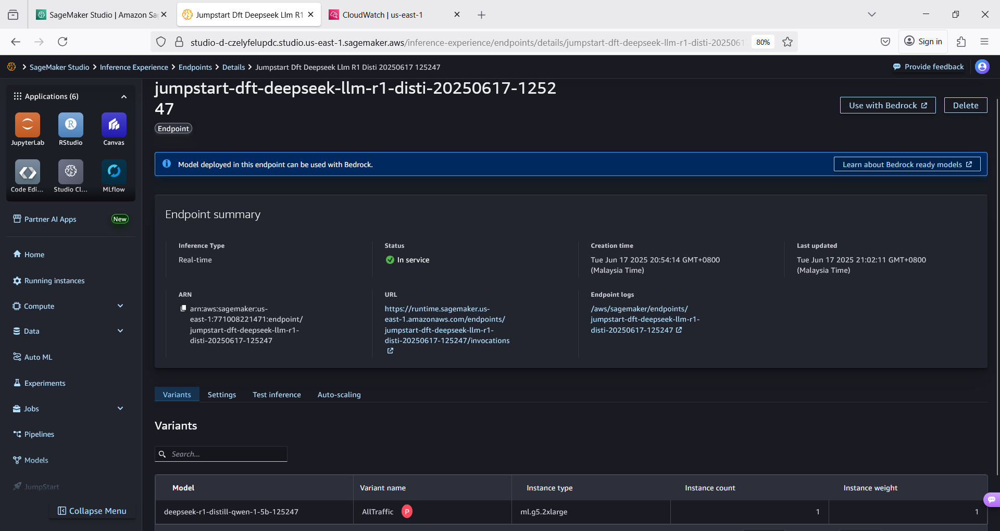

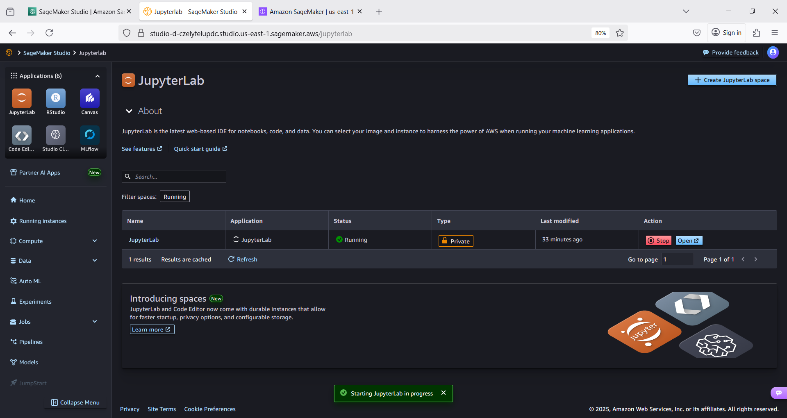

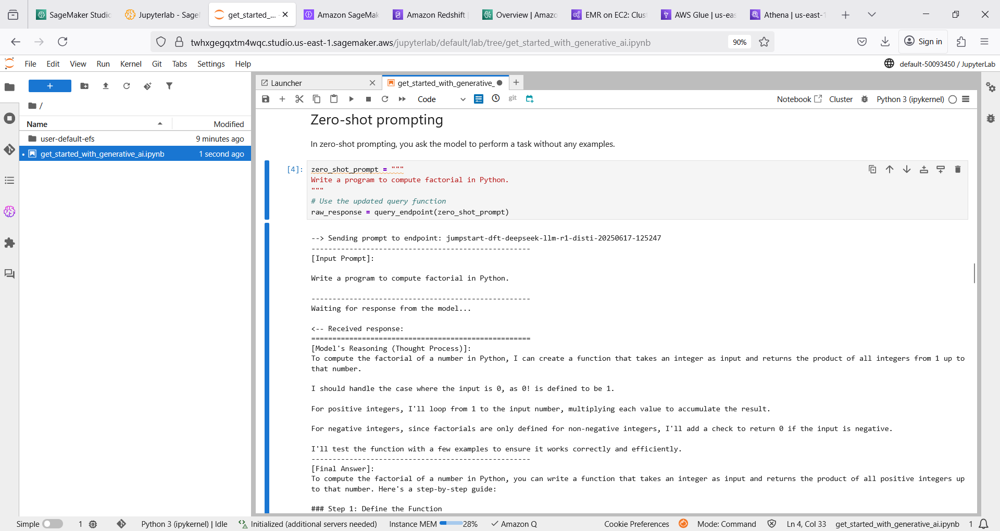

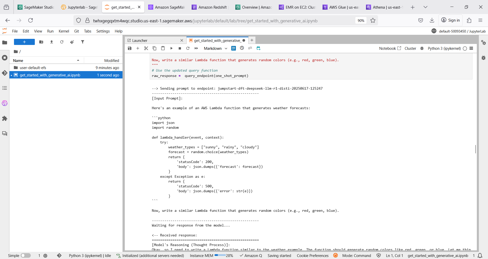

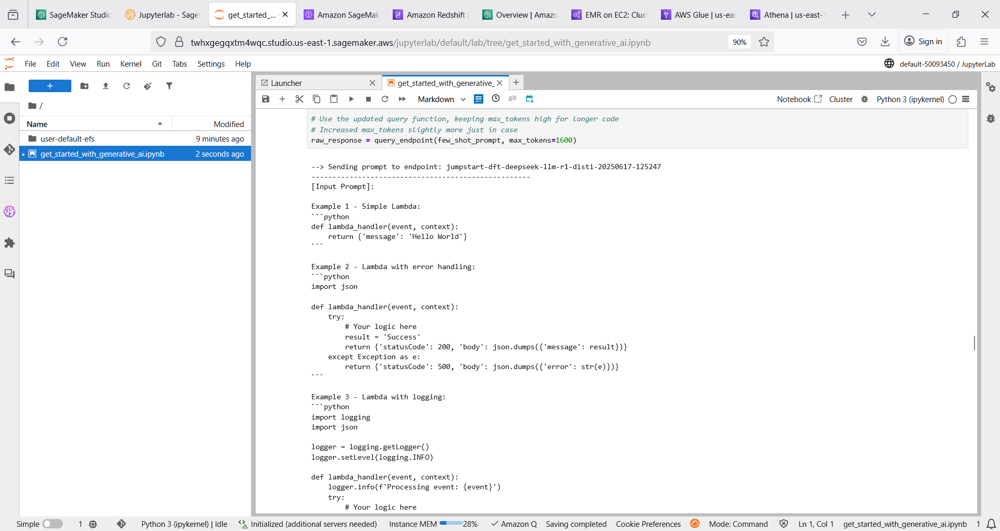

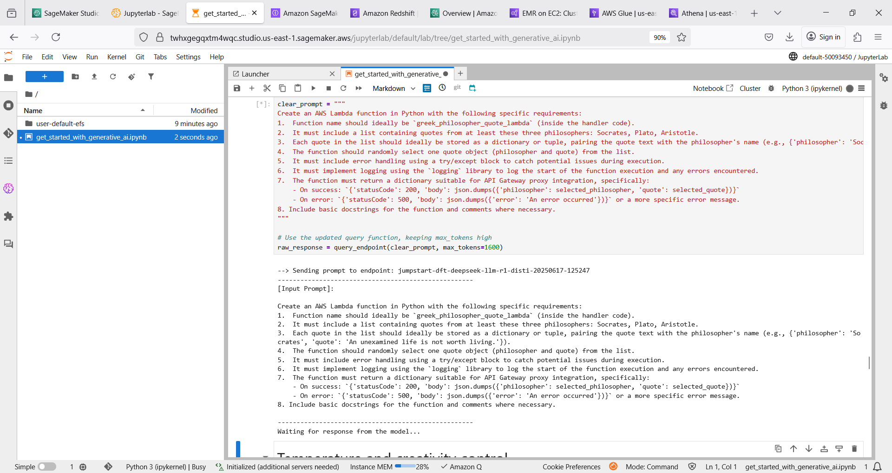

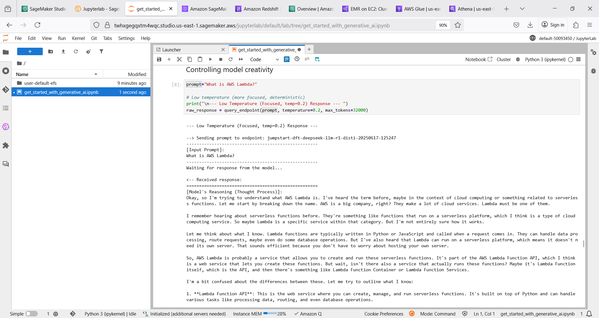

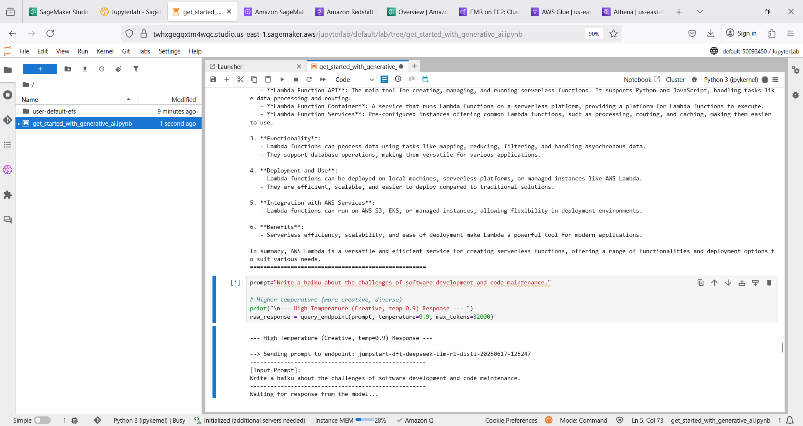

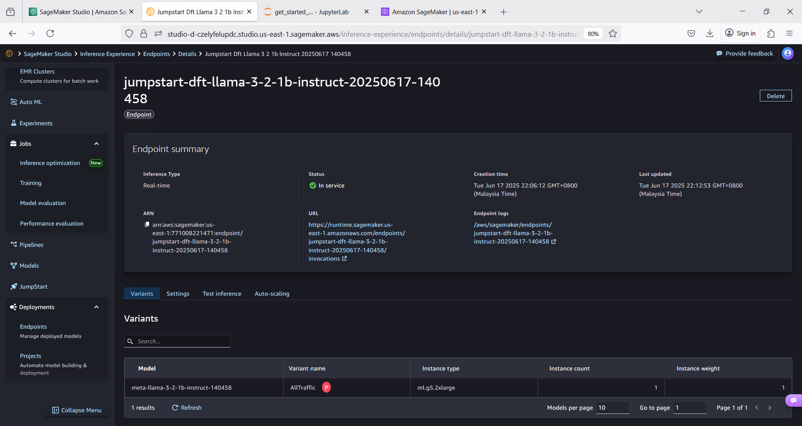

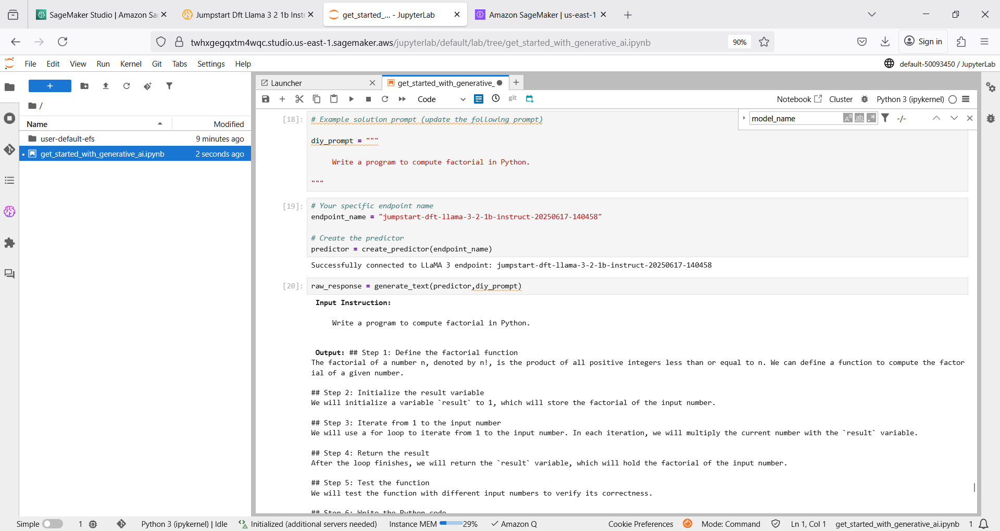

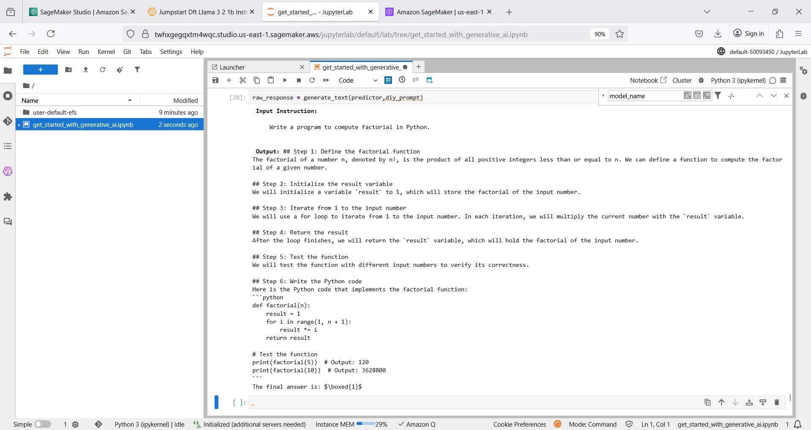
